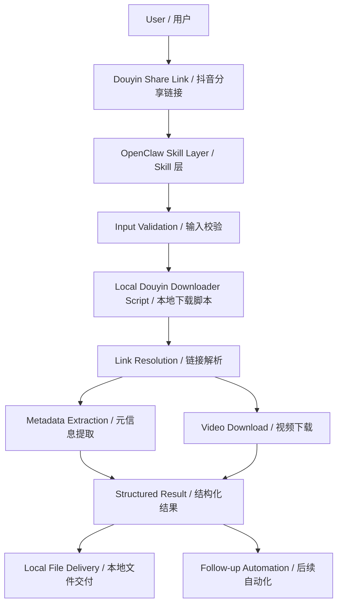
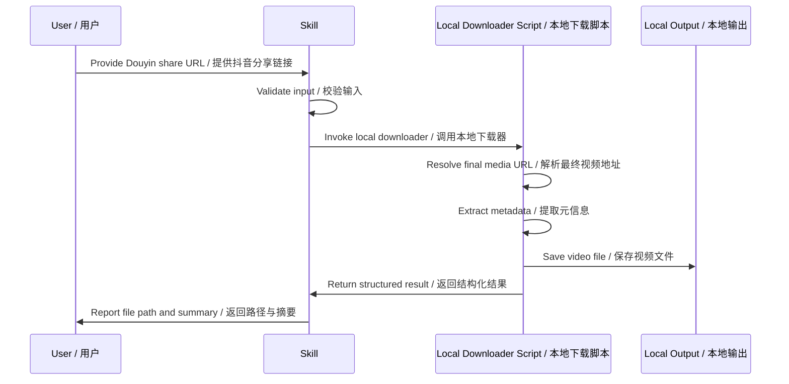
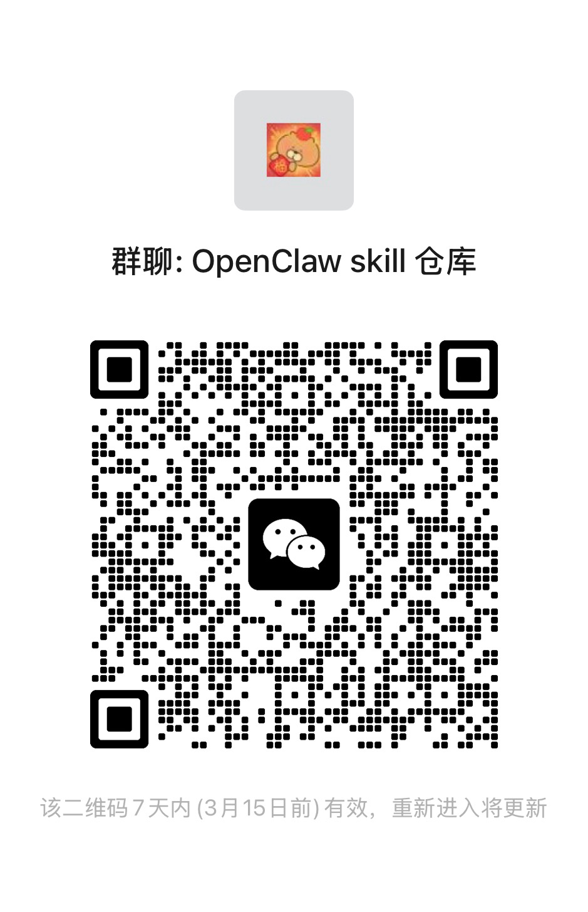

# Douyin Downloader Skill / 抖音下载 Skill

A bilingual, public-facing OpenClaw skill repository for downloading Douyin video assets through a local downloader workflow.

这是一个面向公开发布的双语 OpenClaw skill 仓库，聚焦于**抖音链接解析、无水印视频下载、基础元信息整理与本地文件交付**。

> Positioning / 定位  
> This repository documents a practical skill wrapper around a local Douyin downloader script. It focuses on reproducible workflow, clear boundaries, and clean repository presentation.  
> 本仓库展示的是一个围绕本地抖音下载脚本封装的实用 skill，强调可复用流程、能力边界清晰、以及适合公开展示的仓库结构。

## Highlights / 亮点

- Bilingual documentation / 中英文双语文档
- Public-safe repository structure / 面向公开仓库的安全结构
- No credentials included / 不包含任何密钥或凭据
- Skill-oriented integration for OpenClaw / 面向 OpenClaw 的 skill 集成方式
- Clear non-commercial license / 明确禁止商用的授权协议

## What it does / 核心能力

- Accepts Douyin share links / 接收抖音分享链接
- Resolves downloadable media through a local script / 通过本地脚本解析可下载媒体
- Downloads watermark-free video when supported by the local workflow / 在本地工作流支持的情况下下载无水印视频
- Extracts basic metadata such as title, author, and video id / 提取标题、作者、视频 ID 等基础信息
- Produces structured local output for follow-up automation / 产出适合后续自动化处理的本地结果

## What it does not claim / 不虚构的边界说明

This repository does **not** claim to be an official Douyin API, a cloud SaaS platform, or a universal downloader for every link format.

本仓库**不宣称**自己是官方 Douyin API、云端 SaaS 平台，也不承诺对所有链接格式 100% 通吃。它展示的是一个本地可控、面向自动化集成的 skill 封装方案。

## Repository Structure / 仓库结构

```text
.
├── README.md
├── README.zh-CN.md
├── README.en.md
├── LICENSE
└── skills/
    └── douyin_downloader/
        ├── SKILL.md
        └── README.md
```

## Architecture / 架构图



## Typical Workflow / 典型流程



## Use Cases / 适用场景

- Personal workflow automation / 个人自动化工作流
- Local media collection and organization / 本地媒体整理归档
- Agent skill composition for downstream tasks / Agent 技能编排中的下游处理
- Content review, captioning, or archival pipelines / 内容审阅、转字幕、归档流水线

## Documentation / 文档导航

- 中文说明: [README.zh-CN.md](./README.zh-CN.md)
- English documentation: [README.en.md](./README.en.md)
- Skill definition: [skills/douyin_downloader/SKILL.md](./skills/douyin_downloader/SKILL.md)
- Skill notes: [skills/douyin_downloader/README.md](./skills/douyin_downloader/README.md)

## License / 协议

This repository is released under a **non-commercial license**. You may view, study, and modify the contents for personal or internal use, but **commercial use is prohibited**.

本仓库采用**非商业授权协议**。你可以查看、学习、修改仓库内容，用于个人或内部用途，但**禁止商用**。

See [LICENSE](./LICENSE) for the full text.

---

## Questions / 问题咨询

If you have questions, feedback, or want to discuss usage, you can join the community group by scanning the QR code below.

如果你在使用过程中遇到问题、想反馈建议，或希望交流用法，可以扫描下方二维码加入交流群。



> The QR code may expire and should be refreshed in future updates.  
> 二维码可能会过期，后续可通过仓库更新替换最新版。
